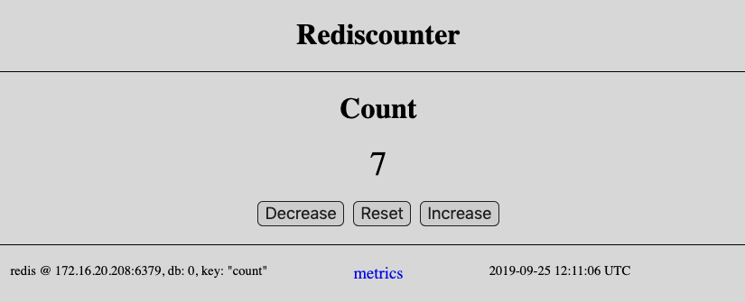
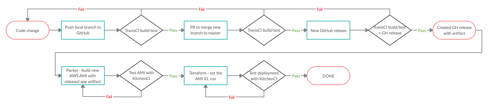

# Web Redis counter

A web application that implements the rediscounter package. When run it will start a web server that can increase and show the counter's value. It also displays the time of the request and information about the redis server connection.

Requests need to be made to the following paths:

* `/incr` will increment the counter and then display the resulting value.
* `/decer` will decrease the counter and then display the resulting value. The counter value will not drop below `0`.
* `/get` will display the current value, without incrementing it.
* `/reset` will reset the counter to `0`.
* `/health` will return HTTP 200 and display OK or HTTP 500 and display "Redis server is down!" depending on the redis server connection status.
* `/metrics` will display usage data for the called paths since the server start.
* `/crash` will shut down the web server.

## Building the command

* install [Golang](https://golang.org/dl/) or use the provided Vagrant [project](../README.md#vagrant-environment) which includes also VMs with Redis and Vault.
* download the package - `go get github.com/slavrd/go-redis-counter`
* build the command - `go build $(go env GOPATH)/src/github.com/slavrd/go-redis-counter/webcounter`

## Running the command

The binary accepts the following options. All of them have defaults set so it can potentially be run without using any of them.

* `-bind-addr` - the address to bind the http server to. Default is `0.0.0.0`.
* `-html-tpl` - path to the go http template rendered by the server. Default is `html/index.gohtml`.
* `-redis-host` - the IP address / name of the redis server host. Default is `127.0.0.1`.
* `-redis-port` - the port of the redis server. Default is `6379`.
* `-redis-pass` - the redis server password. Default is `""` - no authentication required.
* `-redis-db` - the redis server db index. Default is `0`
* `-redis-key` - the redis server key to use for storing the counter's value. Default is `count`

Some parameters can be set using environment variables as well. Precedence is `passed flag > environment variable > flag default`.

* `REDIS_ADDR` - can set the redis server `host` or `host:port`. If it holds only the `host` the `-redis-port` flag (or its default) will be used to complete the address. If it holds `host:port` and the `-redis-port` flag is passed it will be ignored unless the `-redis-host` flag is passed as well.
* `REDIS_PASS` - can set the redis server password.

The application can also retrieve the redis password from Vault. To enable/configure this the following environment vars need to be set:

* `VAULT_TOKEN` - the Vault access token. If this is set the application will attempt to retrieve the pass form Vault.
* `VAULT_ADDR` - the Vault server address. In case the variable is note set the default is `https://127.0.0.1:8200`.
* `VAULT_RP_PATH` - the redis password secret path in Vault. Defaults to `secret/redispassword`.
* `VAULT_RP_KEY` - the redis password secret key in Vault. Defaults to `pass`

**Note:** The application will attempt to retrieve the the password from Vault if and only if `VAULT_TOKEN` is set. In case it is unable to retrieve the password for some reason - cannot connect to vault, secret does not exits etc. it will retry on increasing intervals of up to 1 min. 

In any case the webserver will be started with the redis connection configured based on the values of `REDIS_PASS`/`-redis-pass`. Once the password is retrieved from Vault the connection configuration will be overridden.

Examples:

`./webcounter` will start the server bound on `0.0.0.0`, connecting to redis @ `127.0.0.1:6379` with no authentication.

`./webcounter -redis-server 192.168.10.11 -redis-pass 'mypass'` - will start the server bound on `0.0.0.0`, connecting to redis @ `192.168.10.11:6379`, authenticating with `mypass`

`REDIS_ADDR="192.168.10.11:6379" ./webcounter -redis-port 1111` - will start the server bound on `0.0.0.0`, connecting to redis @ `192.168.10.11:6379` with no authentication.

## Current application deployment flow

**Note:** related repositories containing packer, terraform etc. project code are listed in the root repository [readme](../README.md#related-projects)